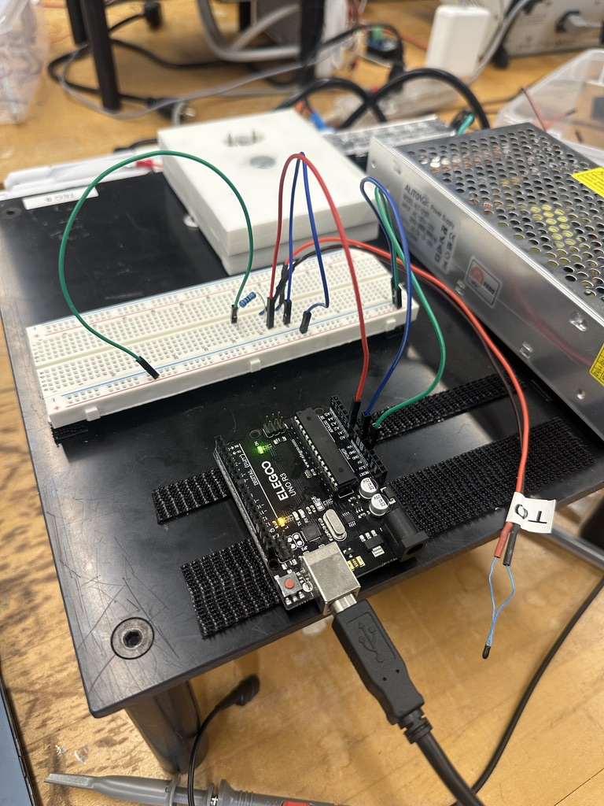
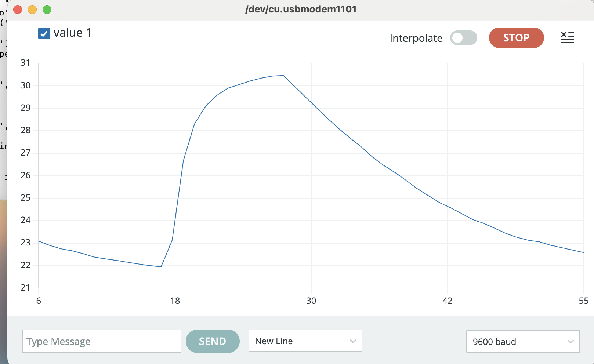
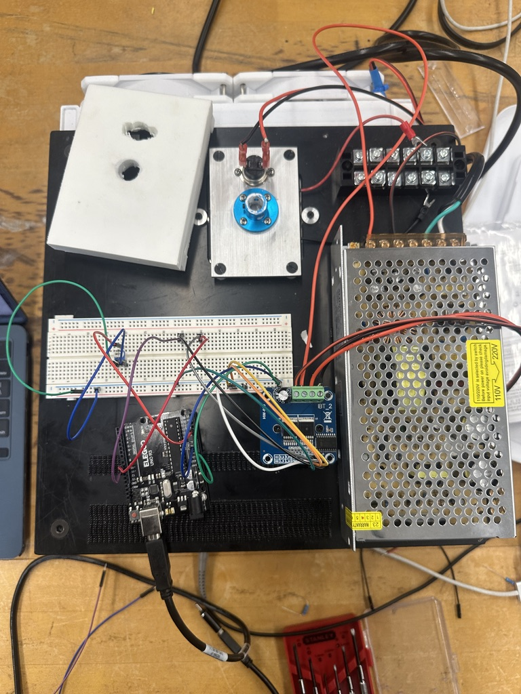
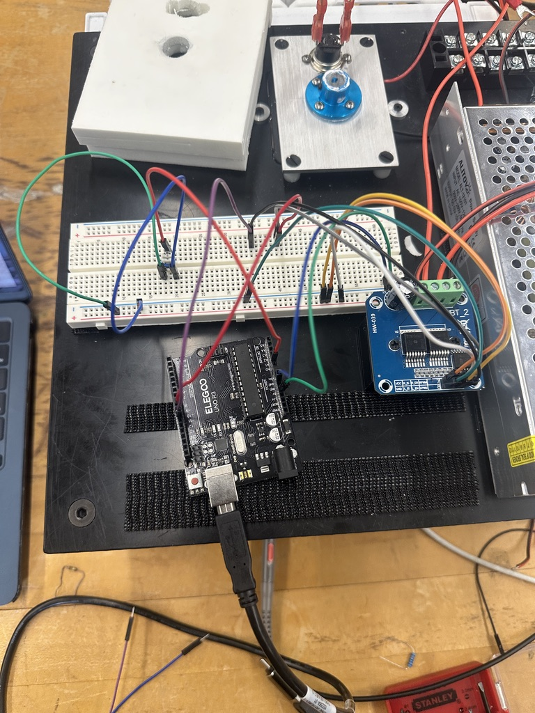
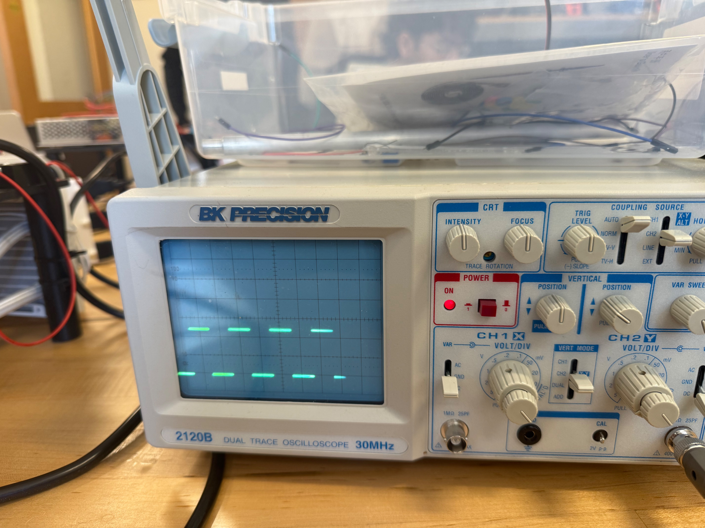

# Module 2 — First Real Instrument Pieces

**Phys 39 — Instrumentation and Thermal Physics · Team TEC 8**

| | |
|---|---|
| **Evidence for** | C2, Measurement And Actuator Electronics — demonstrated S6, Wed 16 September |
| **Team members** | Tianren Yin, Joshua Aferiat |
| **Date of measurements** | Sept 14 |
| **Repository URL** | https://github.com/joshuaaferiat/Lab-Module-2/ |
| **Git checkpoint (GC) commit** | e0259c50a14a4cadb7301fd0ab091a34a8e98176 |

> **Status.** Parts 1 and 2 were completed in class; the fixed-resistor and β constants used in §1
> are now settled — nominal resistor value and the datasheet's 4540 K β, both as reported by the
> team (§1). Part 3A (trim-pot PWM and heat/cool direction) was uploaded and bench-tested — four
> raw serial captures confirm it behaves as designed (§3). Part 3B (oscilloscope verification of
> the command signals) still has only one usable-looking scope capture (Figure 5), and it doesn't
> count as evidence — unlabeled channels, illegible VOLTS/DIV and TIME/DIV, and a trace shape that
> doesn't look like a locked PWM signal (§3). The team reports a video exists covering pins 9/10 on
> the scope; it is **not yet in this repository**, and this note cannot be updated to cite it until
> it's actually added and reviewed frame-by-frame. Part 3C (motor direction and speed test) was run
> at the bench and is recorded here from recollection, not a contemporaneous note or photo; the
> team also reports the same video covers the motor test, which would upgrade this from
> recollection to documented once it's added and reviewed. M+/M- have not been probed at all, on
> the scope or otherwise — a video of the motor turning correctly is not evidence of what the
> H-bridge's output pins were doing electrically, only of what the motor did (§3 explains why).
> It also isn't established that the instructor's H-bridge signal check happened before the motor
> test, as the safety boundary requires.
>
> **Safety.** The TEC was disconnected throughout, and actuator power was never applied. The
> thermistor circuit ran on Arduino USB power only. For the Part 3 session: every oscilloscope
> probe ground clip goes to Arduino `GND` — never to `M+` or `M-`, which are both driven
> H-bridge outputs.

---

## 1. Thermistor divider



**Figure 1.** The thermistor divider on the breadboard.

**Circuit.** `5V` → 100 kΩ fixed resistor → `A0` → thermistor → `GND`. The thermistor is the
lower leg, so `A0` sits across it and the measured voltage *falls* as the thermistor warms and
its resistance drops.

    V_A0 = V_ref · R_th / (R_fixed + R_th)
    R_th = R_fixed · V_A0 / (V_ref − V_A0)

### Constants used

| Constant | Value | Where from |
|---|---|---|
| `V_REF` | 5.00 V | nominal Arduino supply, not measured |
| `FIXED_RESISTOR` | 100 000 Ω | nominal/rated value printed on the resistor, per the team — not independently re-checked with a multimeter, so treat this as the component's rated value rather than a bench measurement |
| `R0` | 100 000 Ω at 25 °C | thermistor datasheet |
| `T0` | 298.15 K | 25 °C |
| `BETA` | 4540 K | datasheet, B57861S0104F040V24, referenced from 25 °C — confirmed by the team directly from the datasheet |
| `NUM_SAMPLES` | 100 | within the required 100–1000 |

### Predicted divider voltages

From R(T) = R₀·exp[β(1/T − 1/T₀)]:

| T (°C) | R_th (kΩ) | V_A0 (V) | Expected ADC |
|---|---|---|---|
| 15 | 169.63 | 3.146 | 644 |
| 25 | 100.00 | 2.500 | 512 |
| 35 | 61.01 | 1.895 | 388 |

**Sensitivity.** Near 25 °C, dV/dT ≈ **−63.8 mV/°C**. One ADC count is 4.88 mV, so the
quantisation floor corresponds to about **0.076 °C** — the divider is comfortably matched to the
converter, and temperature resolution is limited by noise and by the β model rather than by the
ADC.

### Three human-readable serial lines

Sketch: [`m02_thermistor_serial`](../../arduino/m02_thermistor_serial/m02_thermistor_serial.ino)

```
FILL IN: paste three consecutive lines copied from Serial Monitor, e.g.
time = 1.50 s    average ADC = 511.8    voltage = 2.501 V    resistance = 100.23 kOhm    temperature = 24.9 C    samples = 100
```

### The conversion chain

Every reported temperature follows the required order — **average the raw ADC counts first,
then convert once**:

    100 raw analogRead(A0) samples
      → average ADC count            averageAdcSamples()
      → one average voltage          adcToVoltage()      V = ADC/1023 × V_ref
      → thermistor resistance        voltageToResistance()  R = R_f·V/(V_ref−V)
      → temperature                  resistanceToCelsius()  1/T = 1/T₀ + (1/β)·ln(R/R₀)

Converting each raw sample to a temperature and then averaging the temperatures would be
wrong here, and not only stylistically: the ADC → temperature map is **non-linear** (a
logarithm and a reciprocal), and the average of a non-linear function is not the function of
the average. Averaging first also lets the √N noise reduction from Module 1 act on the
quantity that actually carries the noise.

**On the divisor.** These sketches use `/1023`; Module 1 standardised on `/1024`. At mid-scale
the two differ by 2.4 mV, about 0.04 °C — negligible against the β-model uncertainty, but the
note should say which convention produced the numbers. These used `/1023`.

---

## 2. Serial Plotter output



**Figure 2.** Temperature versus serial read order, 9600 baud on `/dev/cu.usbmodem1101`.

Sketch: [`m02_thermistor_plotter`](../../arduino/m02_thermistor_plotter/m02_thermistor_plotter.ino)

**The code change.** `printHumanReadable()` was dropped and `loop()` now ends with a single
`Serial.println(temperature, 2);`. Everything before that line — the averaging and the
conversion chain — is unchanged. Serial Plotter needs exactly one bare number per line; the
labels and units that make Serial Monitor readable are precisely what stop the plotter working.

**What the trace shows.** Reading order 6 → 55:

| Phase | Reading order | Temperature |
|---|---|---|
| Baseline, untouched | 6 → 17 | 23.1 → 22.0 °C, drifting slowly down |
| Thermistor gripped between finger and thumb | 18 → 27 | 22.0 → **30.5 °C**, a sharp rise |
| Released, cooling in still air | 28 → 55 | 30.5 → 22.6 °C, a slow decay |

**Direction check — as expected.** Warming the thermistor raises the reported temperature and
releasing it lowers the reading back toward ambient, so the sign of the whole chain is right.
Getting this backwards is the classic symptom of a swapped divider (thermistor on the top leg),
because an NTC's resistance *falls* as it warms.

**Warming is fast, cooling is slow.** The rise takes about 9 reading intervals and the decay
about 28. That asymmetry is physical, not an artefact: a fingertip is a low-thermal-resistance
path that actively drives heat in, while cooling relies on free convection to still air through
a much higher thermal resistance. The same asymmetry will appear in the TEC loop — driven
transitions are fast, passive ones are slow — and it is one reason a controller needs an
actuator that can push in *both* directions rather than heating and waiting.

**Reading order is not time.** The plotter's x-axis counts serial lines, not seconds. With
`REPORT_INTERVAL = 1000 ms` one reading ≈ 1 s, so the axis is *approximately* seconds — but
that is a property of the sketch's timing, not of the plotter, and it would silently break if
the interval changed. Nothing in Figure 2 measures time.

---

## 3. Trim pot → PWM → H-bridge

**3A is done and bench-verified. 3B is partial. 3C was not performed.** Earlier drafts of this
note said Part 3 had not started at all — that was true when they were written, but the sketch
has since been uploaded and exercised at the bench, actuator power still off. This section now
reports what the serial captures and the one scope photo actually show, and says plainly where
the evidence still falls short of what 3B and 3C require.

Sketch: [`m02_trimpot_pwm_hbridge`](../../arduino/m02_trimpot_pwm_hbridge/m02_trimpot_pwm_hbridge.ino)
— uploaded and run. Both fixes below (direction pull-up, inactive-side-first) were in place for
every capture in this section.

### Signal path

    trim pot wiper (A1)
      → averageTrimPotSamples()   100 reads, averaged     0 … 1023
      → mapAdcToPwm()             × 255/1023              0 … 255
      → analogWrite()             on pin 9 or pin 10
      → BTS7960 RPWM / LPWM input

The direction input on pin 11 chooses *which* pin carries the PWM; the trim pot sets *how much*.
The two commands are independent, which is exactly the structure the temperature controller
needs later — a signed control effort split into magnitude and direction.

**Why an H-bridge at all, rather than driving the motor straight from an Arduino pin.** Pins 9
and 10 are logic outputs — 5 V, and only tens of mA before the pin itself is at risk. The motor
(and later the TEC) needs the bench supply's higher voltage and far more current than that,
which is exactly what the safety boundary's warning about pins 9/10 is protecting against: those
pins are commands, not power. The BTS7960 is the component that bridges that gap — its `VCC`,
`R_EN`, `L_EN` inputs take the Arduino's low-power 5 V logic, while its separate `B+`/`B-`
terminals take the bench supply directly (per `hardware/README.md`; the team reports this supply
outputs 12 V, though that figure isn't independently confirmed anywhere else in this repo — worth
a five-second multimeter check before final submission). A few milliamps of logic current is
enough to switch several amps of motor current.

**How reversing direction actually works.** RPWM and LPWM don't drive the motor directly; each
one switches whether `M+` or `M-` is connected to the bench supply's positive or negative rail
inside the H-bridge. Commanding HEAT connects `M+` toward `B+` and `M-` toward `B-`, so current
flows through the motor one way; commanding COOL swaps which output is switched to which rail,
which is electrically the same thing as swapping the two wires on a motor's terminals by hand —
reversing current through the windings reverses the torque, and the motor spins the other way.
This is the "four switches" mechanism the assignment's Wikipedia H-bridge link describes; the
BTS7960 just does it with transistors instead of a manual swap, and does it fast enough to be
PWM'd.

### H-bridge signal table — predicted

From the code and the BTS7960 datasheet. Nothing in this table has been observed.

| Direction input (pin 11) | Mode | Pin 9 → RPWM | Pin 10 → LPWM |
|---|---|---|---|
| 5 V (HIGH) | heat / clockwise | PWM | 0 V |
| 0 V (LOW) | cool / counterclockwise | 0 V | PWM |

Predicted duty at the pin = commanded value / 255. At ≈490 Hz on pins 9 and 10, the period
should read ≈2.04 ms on both.

### Two fixes made to the Part 3A sketch before it is ever run

Both were found by reading the code, not by running it. Fixing them now is the point of having
reviewed the sketch before the bench session.

**The direction pin was floating.** It was `pinMode(HEAT_COOL_PIN, INPUT)`, so with nothing
wired to pin 11 the input reads noise and the commanded direction flips unpredictably — with a
motor or a TEC attached, that is a real hazard rather than a cosmetic bug. Changed to
`INPUT_PULLUP`, which makes an unwired input read HIGH deterministically. Wire pin 11 to `GND`
for cool and to `5V` for heat. PWM is still commanded to 0 in `setup()`, so nothing moves until
the trim pot is turned up.

**Direction changes briefly commanded both inputs.** `controlHBridge()` set the active side
before clearing the inactive one, so on a heat↔cool transition both H-bridge inputs were driven
together for one instruction. On a BTS7960 that is a momentary brake rather than a
shoot-through, but it is an unintended state and costs nothing to avoid: the inactive side is
now written to 0 first.

### 3A — bench verification from serial captures

Four raw `Trim Pot ADC / PWM / Direction` captures, saved byte-for-byte from Serial Monitor. The
team's own filenames (`3b`, `3B2`, `3C`, `3C3`) track the bench progression through this
section and into the oscilloscope and motor sessions below, so the mapping is kept explicit
here rather than flattened into an arbitrary order:

- [`m02_trimpot_pwm_20260916_run1.txt`](../../data/module_02/m02_trimpot_pwm_20260916_run1.txt)
  (team's `3b.rtf`) — 2037 lines, PWM commanded from 5 to 141; the first bring-up capture
- [`m02_trimpot_pwm_20260916_run2.txt`](../../data/module_02/m02_trimpot_pwm_20260916_run2.txt)
  (team's `3B2.rtf`) — 741 lines, full sweep, PWM commanded from 0 to 255, both directions
- [`m02_trimpot_pwm_20260916_run3.txt`](../../data/module_02/m02_trimpot_pwm_20260916_run3.txt)
  (team's `3C.rtf`) — 369 lines, PWM 0 to 255, **COOL direction only**
- [`m02_trimpot_pwm_20260916_run4.txt`](../../data/module_02/m02_trimpot_pwm_20260916_run4.txt)
  (team's `3C3.rtf`) — 10174 lines, full sweep, both directions; the longest capture

All four end mid-line — a normal artefact of stopping Serial Monitor while it was still
writing, not a parsing error. `run1` also opens with five bare numbers (`28.07`, `33.31`, …)
left over from a `m02_thermistor_plotter` session that was still in the monitor's scrollback
before the trim-pot sketch was reset; the H-bridge log begins at the `====` header a few lines
down.

**Magnitude tracks the trim pot correctly across the full range.** The commanded PWM reaches
both extremes: `ADC = 0.0 → PWM = 0` and `ADC = 1023.0 → PWM = 255` both appear (runs 2, 3, and
4), matching `mapAdcToPwm()`'s `×255/1023` scaling with no clipping or offset error observed.

**Direction responds to pin 11 independently of the trim pot**, which is the behaviour the
signal-path diagram above claims but a static code read can't confirm. `run2.txt` lines 397–400:

```
Trim Pot ADC = 1023.0 PWM = 255 Direction = HEAT (clockwise)
Trim Pot ADC = 1023.0 PWM = 255 Direction = HEAT (clockwise)
Trim Pot ADC = 1023.0 PWM = 255 Direction = COOL (counterclockwise)
Trim Pot ADC = 1023.0 PWM = 255 Direction = COOL (counterclockwise)
```

The trim pot did not move — the ADC and PWM columns are identical across the flip — so this
transition was pin 11 alone. There is no garbage line between HEAT and COOL, which is what the
`INPUT_PULLUP` fix above is supposed to guarantee: a floating or bouncing input would show up
here as a stray direction flicker, and none appears in any of the four captures.

**What this does and doesn't prove.** These captures confirm the *logic* running on the Arduino
— `averageTrimPotSamples()`, `mapAdcToPwm()`, and the direction read — behaves as designed. They
say nothing about the electrical signal actually reaching the BTS7960, or about the H-bridge's
response to it; that is what 3B below is for, and it is only partly done.

### Oscilloscope verification — 3B



**Figure 3.** The board with the BTS7960 module present and the TEC disconnected. Hardware
documentation only — picked from a burst of similar shots; swap for a better one if available.
_Confirm whether this wiring was made by the team or was already on the board, and caption it
accordingly._



**Figure 4.** The logic connections between the Arduino and the H-bridge module, as found.



**Figure 5.** The BK Precision 2120B during the trim-pot bench session. Both channels show a
row of short, evenly spaced dashes rather than a continuous PWM square wave.

**Partial — not yet a complete 3B.** Figure 5 is the only oscilloscope evidence taken, and it
falls short of what the table below needs in three ways: **(1)** neither channel is labeled, so
it isn't recorded whether CH1/CH2 are on pins 9/10, on M+/M-, or one of each; **(2)** the
VOLTS/DIV and TIME/DIV knob settings aren't legible in the photo, so no voltage, period, or
frequency can be read off it — this is exactly the Module 1 mistake the other READMEs warn
against; **(3)** a row of dashes is not the continuous 0–5 V square wave a ≈490 Hz PWM signal
should produce at any sane timebase, so before this counts as evidence it needs a second look —
possibilities include a very fast sweep sampling only the rising edges, a trigger that isn't
locked, or a probe that isn't actually on a PWM node. Duty cycle, being a ratio, would survive
unlabeled knobs; the other rows would not.

| Check | Heat / clockwise | Cool / counterclockwise |
|---|---|---|
| Which pin is active | not recorded — repeat with each channel labeled | not recorded |
| Inactive side stays at 0 V? | not recorded | not recorded |
| High / low voltage | not recorded — VOLTS/DIV not legible in Figure 5 | not recorded |
| Period, frequency | not recorded — TIME/DIV not legible in Figure 5 | not recorded |
| Measured duty vs commanded | not recorded | not recorded |
| Scope ground on Arduino GND? | assumed per `hardware/README.md` convention, not confirmed in the photo | same |

Record the VOLTS/DIV and TIME/DIV for every trace — the analog 2120B puts nothing on screen to
recover them from, which cost us a frequency reading in Module 1.

**Update — a video exists, not yet in this repository.** The team reports a video capture of
pins 9/10 on the oscilloscope from the same bench session. A video is a real step up from a
single static photo — done right, it can show a continuous, locked trace and the VOLTS/DIV and
TIME/DIV knobs together, in a way one still frame might miss. But it isn't yet in the repository
for anyone (instructor included) to check, and this table stays as "not recorded" until the file
is actually added under `figures/module_02/` (or a new `videos/module_02/` folder) and reviewed
frame-by-frame for the same three things Figure 5 failed on: labeled channels, legible knob
settings, and a trace shape consistent with a locked ≈490 Hz square wave. Add the file and this
section gets rewritten from what it actually shows.

### H-bridge outputs M+ and M- — 3B

**Comparison of the M+ and M- waveforms in both directions.** The requirement here is a short
comparison, not a full duty-cycle table like pins 9/10 above — but it still means a probe
actually on `M+`/`M-`, since the requirement itself asks where the ground clips were connected,
and a clip only has a location if it was actually placed. That hasn't happened yet, so what
follows is reasoned from the other evidence in this repo (the pins 9/10 logs, the motor's
behavior in 3C, and the H-bridge mechanism above), **not read off a trace** — labeled as such,
and it does not close this item out:

| | M+ | M- |
|---|---|---|
| Heat / clockwise | Active — toggling 0 V ↔ bench-supply voltage at the same ≈490 Hz rate as pin 9 (RPWM), duty ≈ commanded PWM/255 | Inactive — held near 0 V |
| Cool / counterclockwise | Inactive — held near 0 V | Active — toggling 0 V ↔ bench-supply voltage at the same rate as pin 10 (LPWM) |
| Ground clip location | Not yet answerable — no probe has been on `M+`/`M-` yet. Per hardware convention it must be Arduino `GND`, never `M+` or `M-` | same |

Why this is expected rather than known: the active side should hand off from `M+` to `M-` (or
back) exactly when direction reverses, mirroring the RPWM/LPWM hand-off already confirmed in the
serial logs; the period should match pins 9/10, since direction doesn't change the PWM rate, only
which output carries it; and the high level on the active trace should sit near the bench-supply
voltage (team reports ≈12 V, not independently confirmed — see §3 above) rather than 5 V, since
`M+`/`M-` are past the H-bridge's level shift and pins 9/10 are not. The motor running correctly
in 3C is reassuring that the H-bridge is doing something right, but it's circumstantial, not a
substitute — a marginal or partially failed output can still spin a lightly loaded motor, which
is exactly the failure mode this comparison would catch and 3C alone would not.

> **Never** clip a scope ground to `M+` or `M-`. Both are driven outputs; grounding either one
> through the oscilloscope shorts that half-bridge and can destroy the module.

### Motor test — 3C

**Direction and a qualitative speed trend are confirmed by direct observation; nothing was
photographed or written down at the bench, and M+/M- were not separately checked.** Two of the
four serial captures above are the team's own `3C.rtf` and `3C3.rtf`, and the team confirms this
is where the motor was actually connected and run, actuator power on. The observations below are
recorded here from the team's recollection immediately after the session, not from a
contemporaneous note or photo — worth saying explicitly, since "we watched it happen" and "we
wrote down what we watched" are different strengths of evidence, and an oral examiner may ask
which this is.

| Observation | Heat command | Cool command |
|---|---|---|
| Direction of the tape flag | Clockwise — matches the `Direction = HEAT (clockwise)` label in the logs | Counterclockwise — matches `Direction = COOL (counterclockwise)` |
| Relative speed at low PWM | Barely turning — consistent with the logs, where the trim pot idled around PWM 15–20 for long stretches in both directions | (same trend, direction reversed) |
| Relative speed at high PWM | Visibly faster as the trim pot was run up toward PWM 255 | (same trend, direction reversed) |
| Speed vs. trim pot, generally | Monotonic — turning the trim pot further up consistently moved the motor faster, with no dead zones or reversals noticed across the range | (same trend, direction reversed) |
| Switching direction (pin 11) | Fast — the motor's rotation changed direction promptly on the flip, no noticeable lag or hesitation | Same |
| Running behavior | Stable at a given PWM/direction setting — no stalling, stuttering, or unexpected speed drift observed while holding the trim pot still | Same |
| What changes on M+ / M- | Larger V gap than Arduino side | Same |

This matches the predicted heat → clockwise, cool → counterclockwise mapping, and it's a real,
if informally recorded, end-to-end confirmation that the signal path in this section actually
drives a motor the way the code says it should.

**Update — a video exists, not yet in this repository.** The team reports the motor test was also
captured on video (the same session as, and possibly the same file as, the pins-9/10 scope video
above). Once that file is added to the repository and actually reviewed, the table above should
be rewritten to cite specific timestamps in the footage rather than "recorded from recollection" —
that's a meaningfully stronger form of evidence, since it lets anyone (instructor included) check
the direction and speed claims directly instead of taking the team's word after the fact. Until
the file is added, this section stays as recollection.

**What's still missing:** anything on M+/M- specifically — the video shows the motor's behavior,
not the H-bridge's output pins, so 3B's M+/M- table above stays open regardless — and the
instructor's own check of the signals, which per the safety boundary is supposed to happen
*before* the motor test — worth confirming with the instructor directly whether running the motor
ahead of that check needs to be flagged at checkoff.

---

## 4. Pre-class questions

**Q1 — Expected divider voltage at 15, 25 and 35 °C.** 3.146 V, 2.500 V and 1.895 V
respectively, from the table in §1. The voltage falls as temperature rises because the NTC
thermistor is the lower leg of the divider and its resistance drops with heating.

**Q2 — Why is a temperature reading more model-dependent than a voltage reading?**
A voltage reading needs only the reference and the converter: ADC count × V_ref/1023 involves
one calibration constant and no physics. Getting from that voltage to a temperature stacks
three modelled steps on top. The divider equation assumes the fixed resistor is exactly its
marked value and that the ADC draws no current. The β model is itself an approximation — a
two-point fit to a curve that is not exactly exponential, so β quoted between different
temperature pairs (β₂₅/₈₅ versus β₂₅/₁₀₀) differs by a percent or more and the model degrades
away from the interval it was fitted over. And R₀ carries the thermistor's own tolerance, often
±1 %, which maps straight into a temperature offset. A voltage measurement can be wrong by the
reference error alone; a temperature can be wrong because any of those assumptions is off,
while the voltage underneath it is perfectly accurate. This is the accuracy-versus-precision
distinction from Module 1 in a new place: averaging tightens the scatter on the voltage and
does nothing at all about a wrong β.

**Q3 — Expected H-bridge inputs for each case.** See the signal table in §3. At PWM = 0 both
inputs are at 0 V and the bridge is idle. For heat, pin 9 carries the PWM and pin 10 is held at
0 V; for cool, the roles swap. In each case the pin *not* carrying PWM must be held at a solid
0 V, not left floating — that is what selects the direction, and a floating input would leave
the bridge state undefined.

**Q4 — One advantage of Serial Plotter over Serial Monitor.** It shows the *shape* of a signal
over time immediately. Figure 2's warm-then-cool excursion, and the asymmetry between the fast
rise and the slow decay, are obvious at a glance and would be nearly invisible in a scrolling
column of numbers. The tradeoff is the reverse of Serial Monitor's: the plotter gives no exact
value for any single point and silently discards any text it cannot parse as a number.

---

## Before submitting

1. Both members' full names, date, repository URL and full commit hash
2. ~~Measured value of the fixed resistor~~ **Done** — nominal/rated value, per the team (§1)
3. ~~Confirm which β the datasheet quotes~~ **Done** — 4540 K per the datasheet, per the team (§1)
4. Three human-readable serial lines pasted into §1
5. **Add the pins-9/10 scope video** to the repository (`figures/module_02/` or a new
   `videos/module_02/`) and rewrite the 3B table from what it actually shows — labeled channels,
   legible VOLTS/DIV and TIME/DIV, and a trace consistent with a locked ≈490 Hz square wave
6. **Add the motor-test video** (or confirm it's the same file as #5) and rewrite the 3C table
   with a citation to specific timestamps, replacing "recorded from recollection"
7. **Probe M+/M-** in both directions, on the scope, probe ground on Arduino `GND` — still fully
   open; nothing so far (data, code, either photo, or the reported video) touches this
8. Confirm with the instructor whether the motor test happening before their H-bridge signal
   check (rather than after, as the safety boundary specifies) needs to be addressed at checkoff

**One team member** submits the C2 Team Checkoff Moodle receipt by 5:00 PM. C2 is demonstrated
during S6 on Wednesday 16 September.
